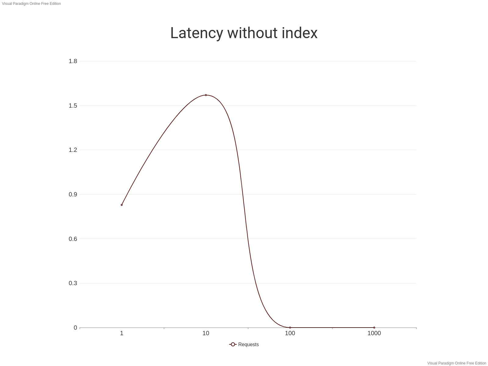
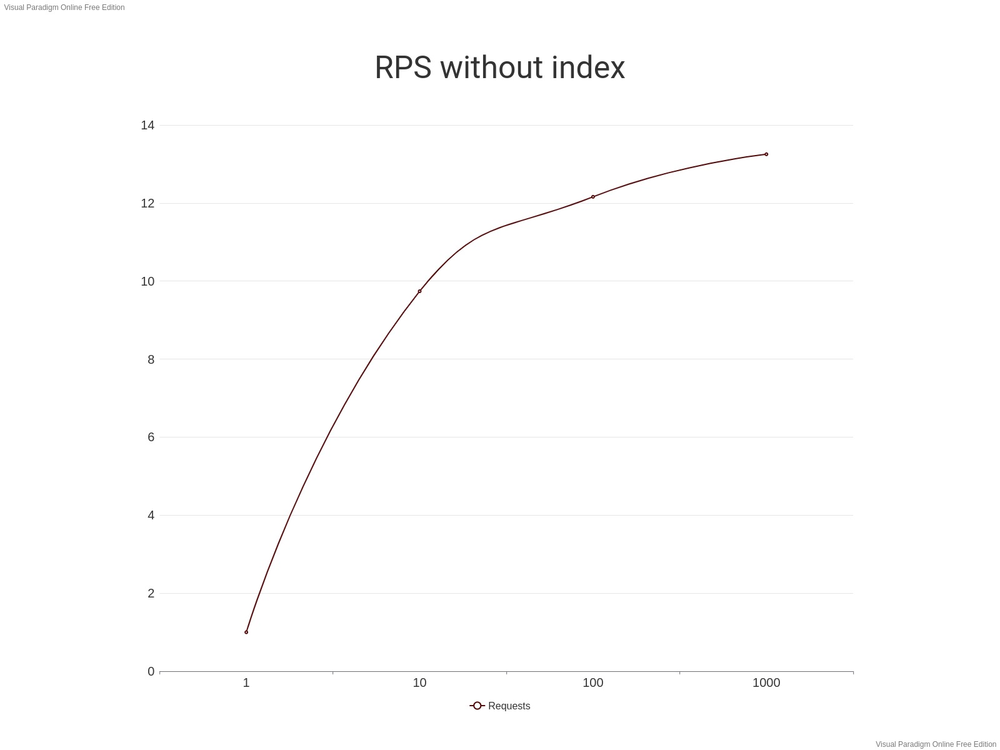
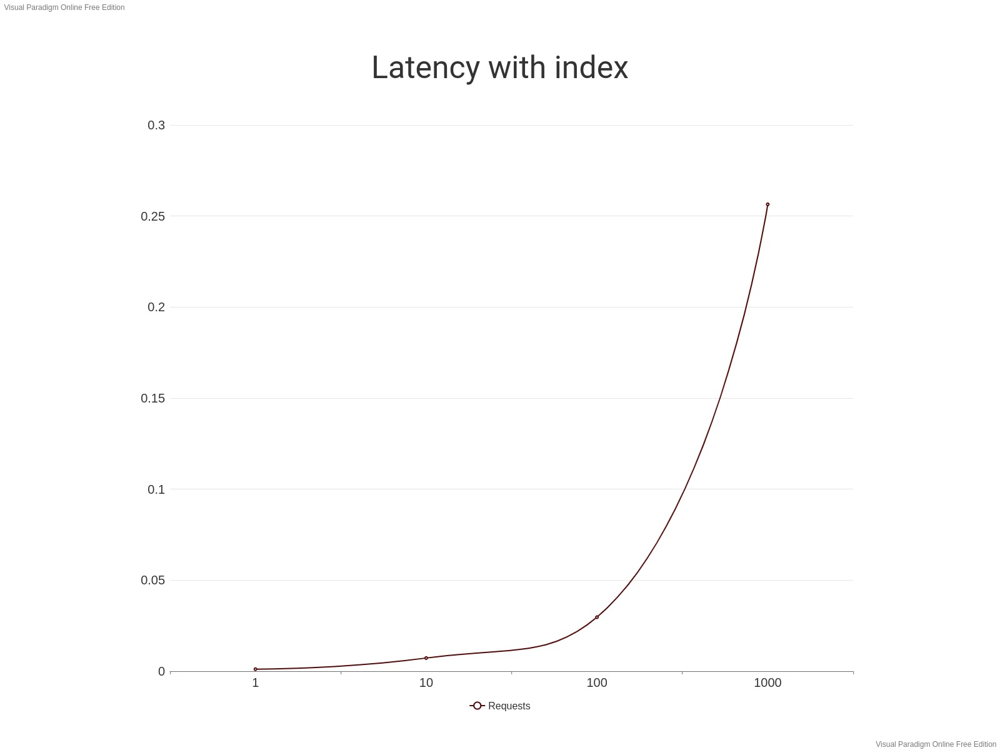
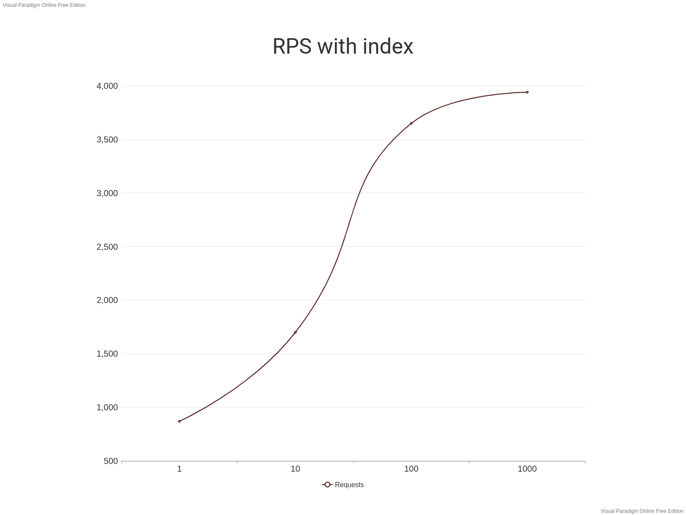

# Отчёт по лабораторной работе №2

## Без индекса

Запуск с 1 одновременным заспром

```bash
wrk -t1 -c1 -d60s --latency http://127.0.0.1:8884/v1/profile/find/and
Running 1m test @ http://127.0.0.1:8884/v1/profile/find/and
  1 threads and 1 connections
  Thread Stats   Avg      Stdev     Max   +/- Stdev
    Latency   828.83ms   21.52ms 925.26ms   88.89%
    Req/Sec     1.00      0.00     1.00    100.00%
  Latency Distribution
     50%  820.36ms
     75%  831.13ms
     90%  860.48ms
     99%  925.26ms
  72 requests in 1.00m, 265.64KB read
Requests/sec:      1.20
Transfer/sec:      4.42KB
```

Запуск с 10 одновременными заспроми

```bash
wrk -t1 -c10 -d60s --latency http://127.0.0.1:8884/v1/profile/find/and
Running 1m test @ http://127.0.0.1:8884/v1/profile/find/and
  1 threads and 10 connections
  Thread Stats   Avg      Stdev     Max   +/- Stdev
    Latency     1.57s   202.44ms   1.99s    70.15%
    Req/Sec     9.74     10.96    70.00     92.64%
  Latency Distribution
     50%    1.58s
     75%    1.71s
     90%    1.84s
     99%    1.97s
  366 requests in 1.00m, 1.32MB read
  Socket errors: connect 0, read 0, write 0, timeout 31
Requests/sec:      6.09
Transfer/sec:     22.48KB
```

Запуск со 100 одновременными заспроми

```bash
wrk -t1 -c100 -d60s --latency http://127.0.0.1:8884/v1/profile/find/and
Running 1m test @ http://127.0.0.1:8884/v1/profile/find/and
  1 threads and 100 connections
  Thread Stats   Avg      Stdev     Max   +/- Stdev
    Latency     0.00us    0.00us   0.00us    -nan%
    Req/Sec    12.16     13.62    90.00     89.86%
  Latency Distribution
     50%    0.00us
     75%    0.00us
     90%    0.00us
     99%    0.00us
  373 requests in 1.00m, 1.34MB read
  Socket errors: connect 0, read 0, write 0, timeout 373
Requests/sec:      6.22
Transfer/sec:     22.93KB
```

Запуск с 1000 одновременными заспроми

```bash
wrk -t1 -c1000 -d60s --latency http://127.0.0.1:8884/v1/profile/find/and
Running 1m test @ http://127.0.0.1:8884/v1/profile/find/and
  1 threads and 1000 connections
  Thread Stats   Avg      Stdev     Max   +/- Stdev
    Latency     0.00us    0.00us   0.00us    -nan%
    Req/Sec    13.25     15.09    80.00     84.90%
  Latency Distribution
     50%    0.00us
     75%    0.00us
     90%    0.00us
     99%    0.00us
  358 requests in 1.00m, 1.29MB read
  Socket errors: connect 0, read 0, write 0, timeout 358
Requests/sec:      5.96
Transfer/sec:     22.01KB
```

График Latency по запросам без индексов


График RPS по запросам без индексов



## С индексом

Запуск с 1 одновременным заспром

```bash
wrk -t1 -c1 -d60s --latency http://127.0.0.1:8884/v1/profile/find/and
Running 1m test @ http://127.0.0.1:8884/v1/profile/find/and
  1 threads and 1 connections
  Thread Stats   Avg      Stdev     Max   +/- Stdev
    Latency     1.15ms  253.98us   8.41ms   89.18%
    Req/Sec     0.87k    62.48     0.96k    80.00%
  Latency Distribution
     50%    1.07ms
     75%    1.13ms
     90%    1.45ms
     99%    2.03ms
  52105 requests in 1.00m, 187.73MB read
Requests/sec:    868.10
Transfer/sec:      3.13MB
```

Запуск с 10 одновременными заспроми

```bash
wrk -t1 -c10 -d60s --latency http://127.0.0.1:8884/v1/profile/find/and
Running 1m test @ http://127.0.0.1:8884/v1/profile/find/and
  1 threads and 10 connections
  Thread Stats   Avg      Stdev     Max   +/- Stdev
    Latency     7.25ms    6.65ms  82.16ms   84.37%
    Req/Sec     1.70k   748.41     3.31k    72.79%
  Latency Distribution
     50%    4.45ms
     75%    9.49ms
     90%   17.77ms
     99%   28.45ms
  101541 requests in 1.00m, 329.60MB read
  Non-2xx or 3xx responses: 10750
Requests/sec:   1692.05
Transfer/sec:      5.49MB
```

Запуск со 100 одновременными заспроми

```bash
wrk -t1 -c100 -d60s --latency http://127.0.0.1:8884/v1/profile/find/and
Running 1m test @ http://127.0.0.1:8884/v1/profile/find/and
  1 threads and 100 connections
  Thread Stats   Avg      Stdev     Max   +/- Stdev
    Latency    29.70ms   20.94ms 405.68ms   85.84%
    Req/Sec     3.65k   453.24     4.59k    88.15%
  Latency Distribution
     50%   25.10ms
     75%   35.52ms
     90%   50.20ms
     99%  114.50ms
  217831 requests in 1.00m, 784.84MB read
Requests/sec:   3630.28
Transfer/sec:     13.08MB
```

Запуск с 1000 одновременными заспроми

```bash
wrk -t1 -c1000 -d60s --latency http://127.0.0.1:8884/v1/profile/find/and
Running 1m test @ http://127.0.0.1:8884/v1/profile/find/and
  1 threads and 1000 connections
  Thread Stats   Avg      Stdev     Max   +/- Stdev
    Latency   256.42ms  315.77ms   2.00s    86.87%
    Req/Sec     3.94k   380.09     4.99k    78.43%
  Latency Distribution
     50%  122.08ms
     75%  348.72ms
     90%  672.95ms
     99%    1.47s
  234927 requests in 1.00m, 846.44MB read
  Socket errors: connect 0, read 0, write 0, timeout 3699
Requests/sec:   3913.74
Transfer/sec:     14.10MB
```

График Latency по запросам с индексом


График RPS по запросам с индексом


## Запрос на добавление индекса

```mysql
ALTER TABLE user ADD INDEX user_serch_idx (first_name, last_name);
```
Индекс составной из полей first_name и last_name, потому что поиск осуществляется по полям first_name и last_name.
Добавление поля id в индекс не влияет на применение индекса.

## Explain запроса
```mysql
EXPLAIN SELECT * FROM user WHERE first_name LIKE "and%" AND last_name LIKE "and%" ORDER BY id;
+----+-------------+-------+------------+-------+----------------+----------------+---------+------+------+----------+---------------------------------------+
| id | select_type | table | partitions | type  | possible_keys  | key            | key_len | ref  | rows | filtered | Extra                                 |
+----+-------------+-------+------------+-------+----------------+----------------+---------+------+------+----------+---------------------------------------+
|  1 | SIMPLE      | user  | NULL       | range | user_serch_idx | user_serch_idx | 2044    | NULL | 2403 |    11.11 | Using index condition; Using filesort |
+----+-------------+-------+------------+-------+----------------+----------------+---------+------+------+----------+---------------------------------------+
```