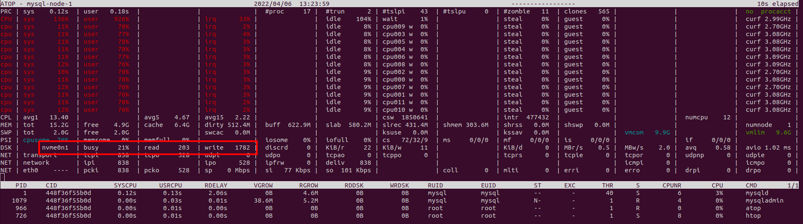
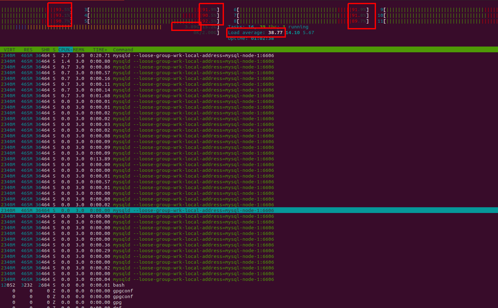
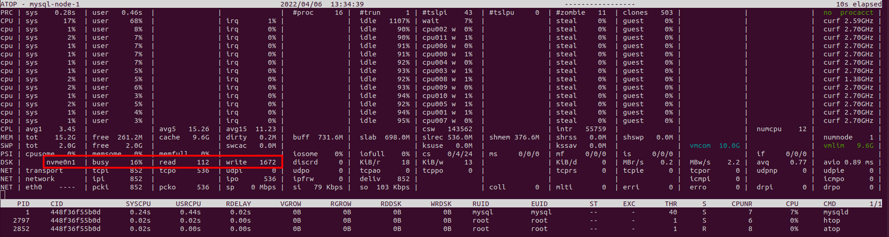
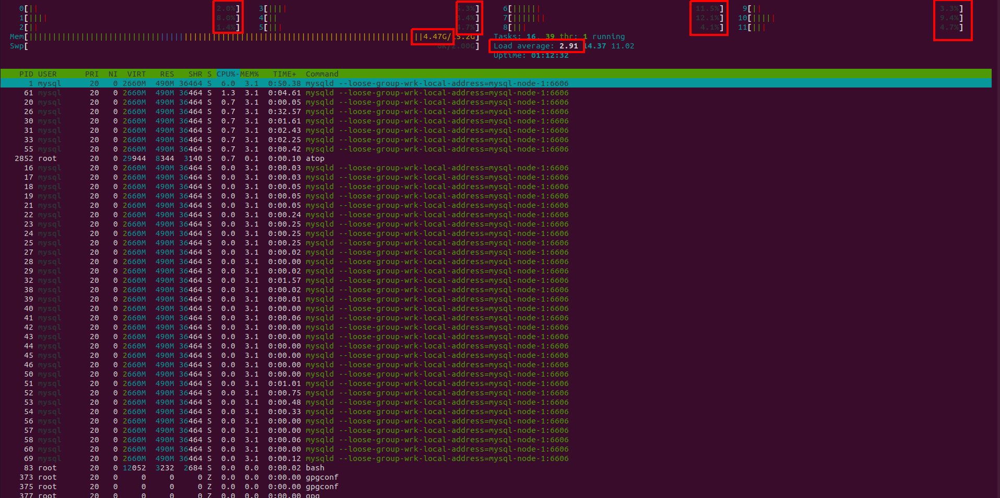

# Отчёт по домашнему заданию №3

## Настройка репликации

В docker-compose-yml описаны 3 контейнера mysql-node-1, mysql-node-2, mysql-node-3
Конфигурационный файл mysql находится по пути data/mysql/config/socialnetwork-db.cnf
Для того, чтобы запустить репликацию нужно поднять контейнеры командой
```bash
docker-compose up
```
А зетем запустить репликацию с мастера на слейвы командой
```bash
chmod +x start_replication.sh
./start_replication.sh
```

Мастером будет mysql-node-1, а mysql-node-2 и mysql-node-3 слейвами
Приложение реализовано так, что все команды на изменение данных пойдут на мастер, а все запросы на чтение данных пойдут на слейв.
Запись и чтение разделены как на уровне модели, так и на уроне потоков, применён подход CQRS.

## Нагрузочное тестирование

### Без репликации

Сначала проводим замеры без репликации. В docker-compose.yml в поле DB_SLAVE_HOST указываем mysql-node-1
И поднимаем контейнеры
```bash
docker-compose up
```

Для снятия метрик нужно поставить htop и atop в контейнере mysql для этого нужно выполнить
Зайти в контейнер с рутовыми правами и установить htop и atop
```bash
docker exec -u 0 -it mysql-node-1 bash
dnf install https://dl.fedoraproject.org/pub/epel/epel-release-latest-8.noarch.rpm
dnf update
dnf install htop
dnf install epel-release && dnf install atop
```

Далее запускаем скрипт по генерации пользователей.
Для запуска потребуется newman, его нужно установить, если его нет.
```bash
chmod +x generate_data.sh
./generate_data.sh
```

И запускаем нагрузку на чтение
```bash
replication -t1 -c100 -d300s http://127.0.0.1:8884/v1/profile/find/and
```

В контейнере mysql-node-1 запускаем htop и atop.
Снимаем метрики.

atop

Загрузка диска 22%

htop

Загрузка CPU порядка 90%
Load average 40
Память 3.9 GB

### С репликацией

В docker-compose.yml в поле DB_SLAVE_HOST указываем mysql-node-2
И поднимаем контейнеры
```bash
docker-compose up
```

Для снятия метрик нужно поставить htop и atop в контейнере mysql для этого нужно выполнить
Зайти в контейнер с рутовыми правами и установить htop и atop
```bash
docker exec -u 0 -it mysql-node-1 bash
dnf install https://dl.fedoraproject.org/pub/epel/epel-release-latest-8.noarch.rpm
dnf install htop
dnf install epel-release && dnf install atop
```

Далее запускаем скрипт по генерации пользователей.
Для запуска потребуется newman, его нужно установить, если его нет.
```bash
chmod +x generate_data.sh
./generate_data.sh
```

И запускаем нагрузку на чтение
(На самом деле так как использую docker-compose, то этот шаг просто пропустил, тем самым съимитировал переход трафика на slave.
Так как в docker-compose ресурсы общие для всех подов. Можно конечно ввести лимиты по памяти и cpu, но htop и atop всеравно показывают потребеление ресурсов всей машины)
```bash
replication -t1 -c100 -d300s http://127.0.0.1:8884/v1/profile/find/and
```

В контейнере mysql-node-1 запускаем htop и atop.
Снимаем метрики.

atop

Загрузка диска 16%

htop

Загрузка CPU порядка 7%
Load average 4
Память 4.47 GB
Подъём по памяти похоже носит шумовой характер. Возможно сам mysql что-то закешировал.

## Переключение мастера

Для того, чтобы запустить репликацию нужно поднять контейнеры командой
```bash
docker-compose up
```
А зетем запустить репликацию с мастера на слейвы командой
```bash
chmod +x start_replication.sh
./start_replication.sh
```

Проверяем количество записей в таблице user во всех нодах mysql
Заходим по все ноды и проверяем количество строк в таблице user

```bash
docker exec mysql-node-1 mysql -usocialnetwork -ppasswd socialnetwork \
  -e "SELECT COUNT(*) FROM user;"
docker exec mysql-node-2 mysql -usocialnetwork -ppasswd socialnetwork \
  -e "SELECT COUNT(*) FROM user;"
docker exec mysql-node-3 mysql -usocialnetwork -ppasswd socialnetwork \
  -e "SELECT COUNT(*) FROM user;"

1013430
```
Количество записей у всех нод должно совпадать

Убеждаемся, что репликация запущена, все ноды работают и матером является mysql-node-1
```bash
docker exec mysql-node-2 mysql -uroot \
  -e "SELECT * FROM performance_schema.replication_group_members;"

CHANNEL_NAME	MEMBER_ID	MEMBER_HOST	MEMBER_PORT	MEMBER_STATE	MEMBER_ROLE	MEMBER_VERSION	MEMBER_COMMUNICATION_STACK
group_replication_applier	a5552dc4-b374-11ec-80b8-0242ac170003	mysql-node-1	3306	ONLINE	PRIMARY	8.0.27	XCom
group_replication_applier	ed359e67-b377-11ec-80b6-0242ac170004	mysql-node-3	3306	ONLINE	SECONDARY	8.0.27	XCom
group_replication_applier	ed3ace2c-b377-11ec-bfeb-0242ac170005	mysql-node-2	3306	ONLINE	SECONDARY	8.0.27	XCom
```

Запускаем генерацию записей
```bash
newman run GenerateData.postman_collection.json -n 10000
```

Ждём пару минут и убиваем процесс мастера и newman

```bash
sudo pkill -9 -f mysql-node-1 & sudo pkill -9 -f newman
```

Смотрим количество успешно созданых записей в результатах работы скрипта генерации (Поле count).
```bash
[INFO] Counter: 3434
```

Проверяем состояние кластера
```bash
docker exec mysql-node-2 mysql -uroot \
  -e "SELECT * FROM performance_schema.replication_group_members;"

CHANNEL_NAME	MEMBER_ID	MEMBER_HOST	MEMBER_PORT	MEMBER_STATE	MEMBER_ROLE	MEMBER_VERSION	MEMBER_COMMUNICATION_STACK
group_replication_applier	ed359e67-b377-11ec-80b6-0242ac170004	mysql-node-3	3306	ONLINE	PRIMARY	8.0.27	XCom
group_replication_applier	ed3ace2c-b377-11ec-bfeb-0242ac170005	mysql-node-2	3306	ONLINE	SECONDARY	8.0.27	XCom
```
Видим, что нода mysql-node-1 не в класетре и мастер переключился на mysql-node-3.
Групповая репликация автоматически меняет мастер ноду, если та стала недотсупна.
Не смотря на то, что нода mysql-node-1 была убита, она было переподнята по всей видимости docker-compose-ом.

Проверяем количество записей во всех нодах в таблице user
```bash
docker exec mysql-node-1 mysql -usocialnetwork -ppasswd socialnetwork \
  -e "SELECT COUNT(*) FROM user;"
docker exec mysql-node-2 mysql -usocialnetwork -ppasswd socialnetwork \
  -e "SELECT COUNT(*) FROM user;"
docker exec mysql-node-3 mysql -usocialnetwork -ppasswd socialnetwork \
  -e "SELECT COUNT(*) FROM user;"

1016864
```
В данном случае количество до генерации совпало с количеством после + количество созданных записей
1013430 + 3434 = 1016864
Однако проводя эксперимент несколько раз, можно заметить, что это не всегда так. Иногда сумма может не сойтись.
Возможно такое, что скажем одна транзакция может потеряться.